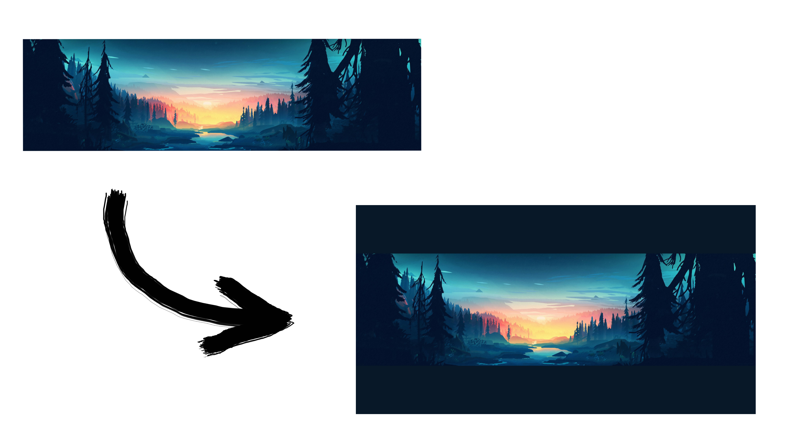

<div align="center">
    <h1>Instagram Posts Formatter</h1>

<a href="https://t.me/ExposedCatDev">


</a>
<a href="https://www.reddit.com/user/ExposedCatDev">

</a>



</div>

<div align="center">
    <h2>⭐️ Features</h2>
</div>
<ul>
    <li>Portrait, Landscape and Standard posts support</li>
    <li>Using image dominant color as the background for the gaps</li>
    <li>Convenient for frontend usage</li>
    <li>Strict code formatting rules</li>
    <li>Scalable file architecture</li>
    <li>Well-readable git repository with a beautiful README :з</li>
</ul>

<div align="center">
    <h2>💼 TODO</h2>
</div>
<ul>
    <li>Write API documentation</a></li>
    <li>Add option to specify custom aspect ratio</a></li>
    <li>Delete images after formatting</a></li>
</ul>

<div align="center">
    <h2>⚙️ Stack</h2>
</div>
<ul>
    <li>Programming language: Node.JS</li>
    <li>API: Express.JS</li>
    <li>Running tools: Docker</li>
</ul>

<div align="center">
    <h2>🔌 Running</h2>
</div>

<div align="center">
    <h2>via pure Node.JS</h2>
</div>

1. Clone this repo:

```bash
git clone https://github.com/ExposedCat/insta-formatter.git
```

2. Go to the project root:

```bash
cd insta-formatter
```

3. Create copy of `.env-example` called `.env` and replace example data with yours
4. Start app (specify name of the config created before):

```bash
CONFIG='.env' npm start
```
<div align="center">
    <h2>via Docker/Podman</h2>
</div>

0. Install [Docker](https://docs.docker.com/get-docker/) or [Podman](https://podman.io/getting-started/installation)
1. Clone this repo:

```bash
git clone https://github.com/ExposedCat/insta-formatter.git
```

2. Go to project root:

```bash
cd insta-formatter
```

3. Create copy of `.env-example` called `.env` and replace example data with yours
4. Build app image:

```bash
docker build -t insta-formatter-api .
```
or
```bash
podman build -t insta-formatter-api .
```

5. Start app:

```bash
docker-copmpose up -d
```
or
```bash
podman-copmpose up -d
```

**Done**.

<div align="center">
    <h2>via Nodemon</h2>
    <h4>for development</h4>
</div>

0. Install and run <a href="https://www.mongodb.com/try/download/community">MongoDB server</a>
1. Clone this repo:

```bash
git clone https://github.com/ExposedCat/insta-formatter.git
```

2. Go to project root:

```bash
cd insta-formatter
```

3. Create copy of `.env-example` and replace example data with yours
4. Install dependencies:

```bash
npm install
```

5. Start app (specify name of the config created before):

```bash
CONFIG='.env' npm run dev
```

**Done**.

<div align="center">
    <h2>🔩 Dependencies</h2>
</div>
<h3>Production</h3>
<ul>
    <li>Express.JS</li>
    <li>DotEnv</li>
    <li>Helmet</li>
    <li>UUID</li>
</ul>
<h3>Development</h3>
<ul>
    <li>Nodemon</li>
    <li>Prettier</li>
</ul>
